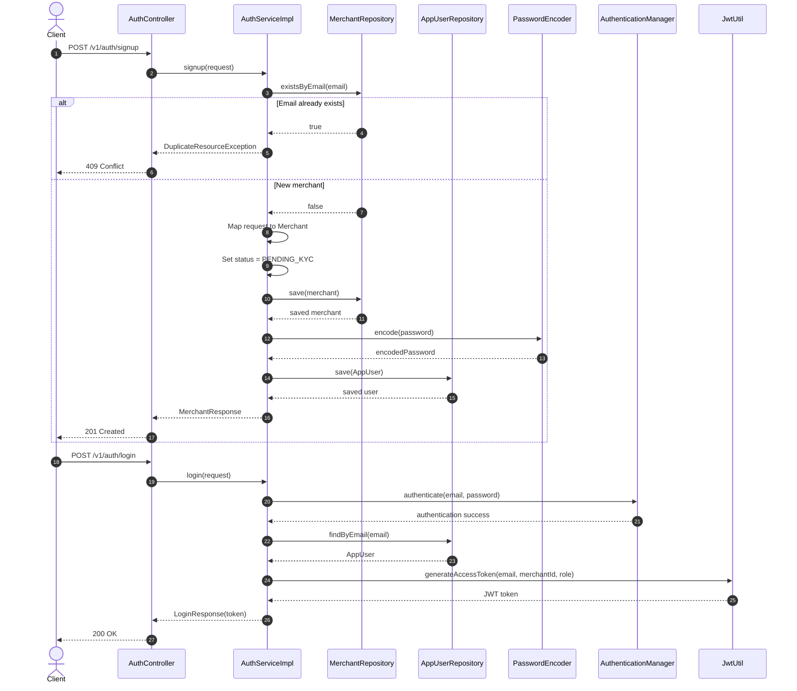

# AuthController Workflow

This document explains the working of the AuthController and the flow behind the merchant authentication APIs.

## Base route

The controller is mapped to:

- /v1/auth

It has two public endpoints:

- POST /v1/auth/signup
- POST /v1/auth/login

---

## 1) POST /v1/auth/signup

### Purpose
Creates a new merchant account and its associated app user.

### Controller method
```java
@PostMapping("/signup")
public ResponseEntity<MerchantResponse> signup(@RequestBody @Valid MerchantSignupRequest request) {
    return ResponseEntity.status(HttpStatus.CREATED).body(
            authService.signup(request)
    );
}
```

### Flow
1. The client sends a request with a valid MerchantSignupRequest.
2. The controller validates the request body using @Valid.
3. The request is delegated to AuthService.signup(request).
4. Inside AuthServiceImpl.signup(...):
   - checks whether a merchant with the same email already exists
   - throws DuplicateResourceException if found
   - maps the request into a Merchant entity
   - sets merchant status to PENDING_KYC
   - saves the merchant
   - creates an AppUser with:
     - email
     - linked merchant
     - passwordHash generated by PasswordEncoder
     - role = OWNER
   - saves the user
5. The controller returns a 201 Created response with MerchantResponse.

### Important behavior
- A fresh signup creates both:
  - a merchant record
  - a user record for login / authentication
- Passwords are encoded before saving using Spring Security PasswordEncoder (BCrypt).

---

## 2) POST /v1/auth/login

### Purpose
Authenticates a user using email and password and returns a JWT access token.

### Controller method
```java
@PostMapping("/login")
public ResponseEntity<LoginResponse> login(@RequestBody @Valid LoginRequest request) {
    return ResponseEntity.status(HttpStatus.OK).body(
            authService.login(request)
    );
}
```

### Flow
1. The client sends email and password in LoginRequest.
2. The controller validates the request through @Valid.
3. It delegates to AuthService.login(request).
4. Inside AuthServiceImpl.login(...):
   - calls AuthenticationManager.authenticate(...)
   - validates user credentials using UsernamePasswordAuthenticationToken
   - loads the AppUser by email
   - generates a JWT using JwtUtil.generateAccessToken(...)
   - returns LoginResponse with the token
5. The controller returns 200 OK with LoginResponse.

### Important behavior
- Login is a real authentication step through Spring Security.
- Successful authentication returns a JWT that is later used to access protected APIs.

---

## Security note

The security config allows these routes without prior JWT:

- /v1/auth/signup
- /v1/auth/login

Other protected routes require authentication. Once a JWT is generated, it is used in the Authorization header as:

- Authorization: Bearer <token>

---

## Sequence Diagram



---

## Summary

The AuthController is a thin HTTP layer. It validates request payloads and delegates actual business logic to AuthServiceImpl.

- Signup creates a merchant and app user.
- Login authenticates credentials and issues a JWT.
- The JWT is later used for protected routes across the application.
