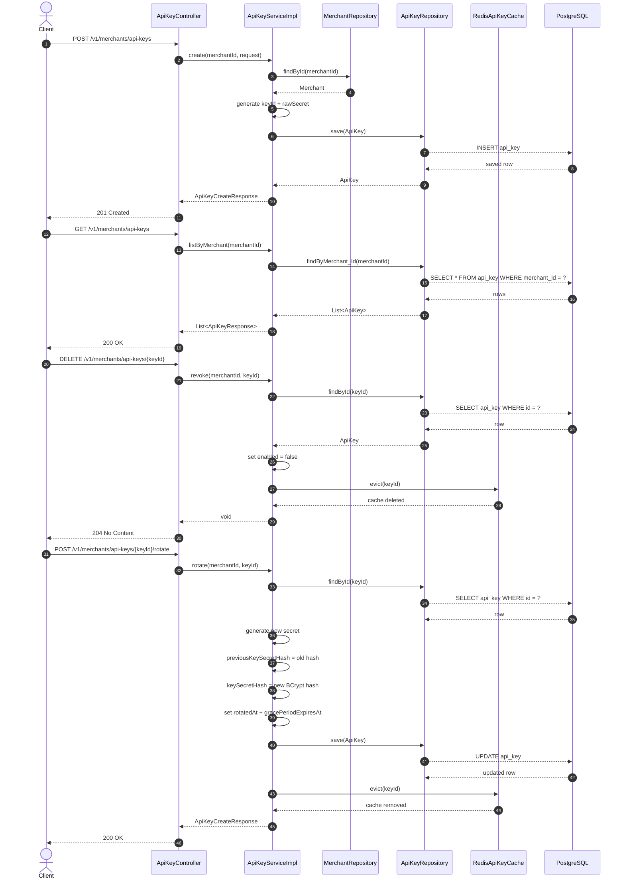
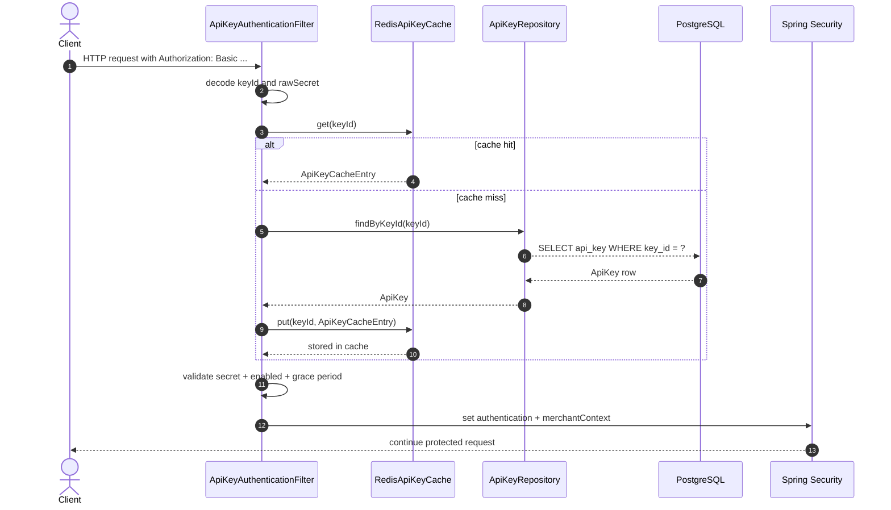

# ApiKeyController Documentation

This document explains the current implementation of the API key management controller and its runtime flow.

## Base route

The controller is mapped to:

- /v1/merchants/api-keys

Controller class:

- com.codingshuttle.razorpay.merchant.controller.ApiKeyController

---

## Controller methods

### 1) Create API key

Endpoint:

- POST /v1/merchants/api-keys

Method:

```java
@PostMapping
public ResponseEntity<ApiKeyCreateResponse> create(@Valid @RequestBody CreateApiKeyRequest request) {
    return ResponseEntity.status(HttpStatus.CREATED)
            .body(apiKeyService.create(merchantContext.getMerchantId(), request));
}
```

#### Flow
1. The client sends a POST request with a CreateApiKeyRequest body.
2. The request is validated by @Valid.
3. The controller reads the current merchant ID from MerchantContext.
4. It calls apiKeyService.create(merchantId, request).
5. The service loads the merchant from MerchantRepository.
6. It generates:
   - keyId in the format: rzp_<environment>_<random>
   - rawSecret as a random base64 string
7. It creates an ApiKey entity with:
   - merchant
   - keyId
   - BCrypt-hashed keySecretHash
   - environment
   - enabled = true
8. It saves the entity in PostgreSQL using ApiKeyRepository.
9. It returns ApiKeyCreateResponse containing the generated ID, keyId, raw secret, and environment.

#### Response
```java
public record ApiKeyCreateResponse(
        UUID id,
        String keyId,
        String keySecret,
        Environment environment
) {}
```

---

### 2) List API keys for merchant

Endpoint:

- GET /v1/merchants/api-keys

Method:

```java
@GetMapping
public ResponseEntity<List<ApiKeyResponse>> listByMerchant() {
    return ResponseEntity.ok(apiKeyService.listByMerchant(merchantContext.getMerchantId()));
}
```

#### Flow
1. The controller reads merchantId from MerchantContext.
2. It calls apiKeyService.listByMerchant(merchantId).
3. The service queries ApiKeyRepository.findByMerchant_Id(merchantId).
4. It maps the list to ApiKeyResponse objects through ApiKeyMapper.
5. The controller returns the list with HTTP 200 OK.

#### Response
```java
public record ApiKeyResponse(
        UUID id,
        String keyId,
        Environment environment,
        boolean enabled,
        LocalDateTime lastUsedAt,
        LocalDateTime createdAt
) {}
```

---

### 3) Revoke API key

Endpoint (as implemented):

- DELETE /v1/merchants/api-keys/keyId

Method:

```java
@DeleteMapping("/keyId")
public ResponseEntity<Void> revoke(@PathVariable UUID keyId) {
    apiKeyService.revoke(merchantContext.getMerchantId(), keyId);
    return ResponseEntity.noContent().build();
}
```

#### Important note
The route is currently defined as /keyId instead of /{keyId}. In the current implementation, the path variable is still accepted by Spring because the method is typed as @PathVariable UUID keyId, but the route pattern itself is not conventional. The intended pattern is likely:

- DELETE /v1/merchants/api-keys/{keyId}

#### Flow
1. The client calls the revoke endpoint.
2. The controller gets merchantContext.getMerchantId() and keyId.
3. The service loads the ApiKey by id and verifies that it belongs to the same merchant.
4. If not found or not owned by the merchant, it throws ResourceNotFoundException.
5. The service sets enabled = false.
6. It evicts the Redis cache entry for the keyId.
7. The controller returns 204 No Content.

---

### 4) Rotate API key

Endpoint:

- POST /v1/merchants/api-keys/{keyId}/rotate

Method:

```java
@PostMapping("/{keyId}/rotate")
public ResponseEntity<ApiKeyCreateResponse> rotateKey(@PathVariable UUID keyId) {
    return ResponseEntity.ok(apiKeyService.rotate(merchantContext.getMerchantId(), keyId));
}
```

#### Flow
1. The controller reads the merchantId from MerchantContext and keyId from path.
2. It calls apiKeyService.rotate(merchantId, keyId).
3. The service validates that the key belongs to the merchant.
4. It checks whether the key is enabled.
5. If enabled, it creates a new raw secret.
6. It stores the previous secret hash in previousKeySecretHash.
7. It replaces the current keySecretHash with the BCrypt hash of the new secret.
8. It sets rotatedAt and gracePeriodExpiresAt = now + 24 hours.
9. It saves the updated entity.
10. It evicts the Redis cache entry for the keyId.
11. It returns the new ApiKeyCreateResponse with the new raw secret.

#### Grace period behavior
During the 24-hour grace period, the previous secret is still accepted for authentication. This is checked in ApiKeyAuthenticationFilter:

```java
return apiKey.isInGracePeriod()
        && apiKey.previousKeySecretHash() != null
        && BCRYPT.matches(rawSecret, apiKey.previousKeySecretHash());
```

---

## Service layer behavior

Service class:

- com.codingshuttle.razorpay.merchant.service.impl.ApiKeyServiceImpl

### Key responsibilities
- create new API keys for a merchant
- list API keys by merchant
- revoke a key by disabling it
- rotate a key and maintain previous secret support for grace period
- clear cache entries after changes

### Example creation logic
```java
String keyId = "rzp_" + request.environment().name().toLowerCase() + "_" + RandomizerUtil.randomBase64(24);
String rawSecret = RandomizerUtil.randomBase64(40);

ApiKey apiKey = ApiKey.builder()
        .merchant(merchant)
        .keyId(keyId)
        .keySecretHash(BCRPYT.encode(rawSecret))
        .environment(request.environment())
        .build();
```

This means the secret is never stored in plain text in Postgres. Only the BCrypt hash is stored.

---

## How the API key is stored in PostgreSQL

The database entity is:

- com.codingshuttle.razorpay.merchant.entity.ApiKey

Entity annotation:

```java
@Entity
@Table(name = "api_key",
        indexes = {
            @Index(name = "idx_api_key_merchant_env", columnList = "merchant_id, environment, enabled")
        })
```

### Fields in the table

```java
@Id
@GeneratedValue(strategy = GenerationType.UUID)
private UUID id;

@ManyToOne(fetch = FetchType.LAZY, optional = false)
@JoinColumn(name = "merchant_id", nullable = false)
private Merchant merchant;

@Column(nullable = false, length = 50, unique = true)
private String keyId;

@Column(nullable = false, length = 200)
private String keySecretHash;

@Column(length = 200)
private String previousKeySecretHash;

@Enumerated(EnumType.STRING)
@Column(nullable = false, length = 10)
private Environment environment;

@Column(nullable = false)
@Builder.Default
private boolean enabled = true;

private LocalDateTime lastUsedAt;
private LocalDateTime rotatedAt;
private LocalDateTime gracePeriodExpiresAt;
```

### Meaning of storage
- `merchant_id`: foreign key to merchant
- `key_id`: unique public identifier for the API key
- `keySecretHash`: BCrypt hash of the secret
- `previousKeySecretHash`: kept during rotation grace window
- `environment`: enum such as SANDBOX / PRODUCTION
- `enabled`: soft disable flag for revocation
- `rotatedAt`, `gracePeriodExpiresAt`: used for rotation lifecycle

### Database repository
```java
public interface ApiKeyRepository extends JpaRepository<ApiKey, UUID> {
    List<ApiKey> findByMerchant_Id(UUID merchantId);
    Optional<ApiKey> findByKeyId(String keyId);
}
```

This enables:
- lookup by merchant
- lookup by unique keyId for request authentication

---

## How the API key is stored in Redis cache

The cache layer is implemented by:

- com.codingshuttle.razorpay.merchant.cache.ApiKeyCache
- com.codingshuttle.razorpay.merchant.cache.RedisApiKeyCache
- com.codingshuttle.razorpay.merchant.cache.ApiKeyCacheEntry

### Cache interface
```java
public interface ApiKeyCache {
    Optional<ApiKeyCacheEntry> get(String keyId);
    void put(String keyId, ApiKeyCacheEntry entry);
    void evict(String keyId);
}
```

### Redis cache implementation
```java
@Component
public class RedisApiKeyCache implements ApiKeyCache {

    private static final String PREFIX = "apikey:";
    private static final Duration TTL = Duration.ofMinutes(5);

    private final StringRedisTemplate stringRedisTemplate;
    private final ObjectMapper objectMapper;
```

### Redis key format
```text
apikey:<keyId>
```

Example:
```text
apikey:rzp_sandbox_xxx...
```

### TTL and JSON payload
The cache stores a JSON representation of ApiKeyCacheEntry with a 5 minute TTL:

```java
stringRedisTemplate.opsForValue().set(PREFIX + keyId,
        objectMapper.writeValueAsString(entry),
        TTL);
```

### Value shape
```java
public record ApiKeyCacheEntry(
        String keyId,
        String keySecretHash,
        String previousKeySecretHash,
        LocalDateTime gracePeriodExpiresAt,
        UUID merchantId,
        Environment environment,
        boolean enabled
) {}
```

So Redis caches a lightweight version of the API key, not the whole entity. It is used for faster authentication checks.

---

## Authentication flow using API key

The request authentication path is handled by ApiKeyAuthenticationFilter.

### Header format
The client sends credentials in Basic auth format:

```http
Authorization: Basic <base64(keyId:secret)>
```

Example:
```text
Authorization: Basic cnpwX3NhbmRib3hf...:c2VjcmV0X2F...==
```

### Flow inside the filter
1. Read Authorization header.
2. Check whether it starts with Basic.
3. Decode the base64 string into keyId + rawSecret.
4. Try to fetch the entry from Redis cache:
   - apiKeyCache.get(keyId)
5. If not in Redis, load from PostgreSQL and save to cache.
6. Validate:
   - key exists
   - enabled = true
   - secret matches current hash or previous hash during grace period
7. Check rate limit.
8. If valid, create Spring Security authentication and set MerchantContext.
9. Continue request pipeline.

### Cache lookup code
```java
ApiKeyCacheEntry apiKeyEntry = apiKeyCache.get(keyId)
        .orElseGet(() -> loadAndCache(keyId));
```

### Secret validation code
```java
private boolean secretMatches(String rawSecret, ApiKeyCacheEntry apiKey) {
    if (BCRYPT.matches(rawSecret, apiKey.keySecretHash())) {
        return true;
    }
    return apiKey.isInGracePeriod()
            && apiKey.previousKeySecretHash() != null
            && BCRYPT.matches(rawSecret, apiKey.previousKeySecretHash());
}
```

---

## Sequence diagrams for all methods

### Combined method sequence diagram



### Authentication sequence for incoming API requests



---

## Summary

The ApiKeyController is responsible for managing merchant API keys. The workflow is:

- create a new key
- list keys for the merchant
- revoke a key by disabling it
- rotate a key by replacing the secret and keeping previous-secret compatibility for 24 hours

The keys are stored in PostgreSQL as hashed values and cached in Redis for fast validation during incoming API requests. This design gives both security and performance:

- DB is the source of truth
- Redis is a hot cache for authentication lookups
- BCrypt hashing prevents plain-text secret storage
- grace-period rotation allows a safe transition without breaking existing clients immediately
