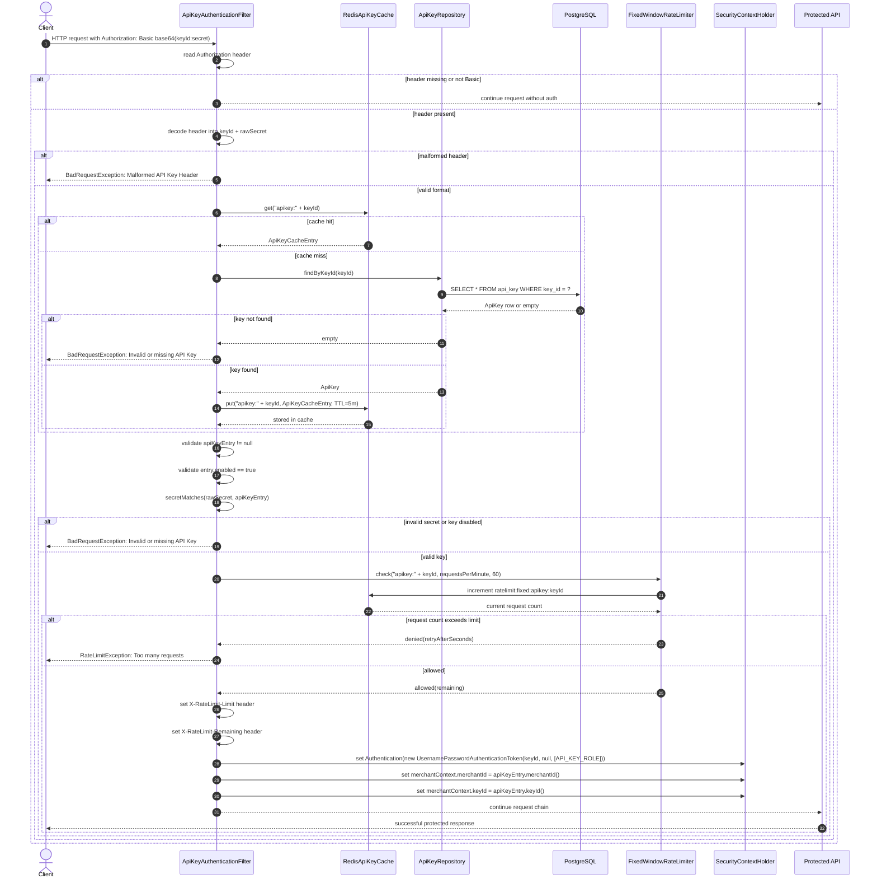

# ApiKeyAuthenticationFilter Flow

This document explains how the API key authentication filter validates an incoming request, checks Redis, falls back to PostgreSQL, validates the key and secret, enforces rate limiting, and sets security context values before allowing the request to continue.

## Class

- `com.codingshuttle.razorpay.merchant.security.ApiKeyAuthenticationFilter`

## What it does

This filter runs before protected API routes and validates requests that use HTTP Basic authentication with an API key.

Example header:

```http
Authorization: Basic <base64(keyId:secret)>
```

The filter performs the following steps:

1. Reads the `Authorization` header.
2. Verifies that the header is in Basic auth format.
3. Decodes the header into `keyId` and `rawSecret`.
4. Checks Redis cache for the API key entry.
5. If missing in Redis, loads the API key from PostgreSQL using `ApiKeyRepository.findByKeyId(keyId)`.
6. Caches the result back into Redis.
7. If the key is not found, throws an exception.
8. Verifies the key is enabled and the secret matches the hash.
9. Checks the fixed-window rate limiter for the same API key.
10. Adds rate-limit headers to the response.
11. Creates a Spring Security authentication token.
12. Sets the merchant ID and key ID in the security context.
13. Continues the request to the protected API.

---

## Flow summary

### 1. Header validation

The filter reads the request header:

```java
String header = request.getHeader("Authorization");
if (header == null || !header.startsWith(BASIC_PREFIX)) {
    filterChain.doFilter(request, response);
    return;
}
```

If there is no `Authorization` header or it does not begin with `Basic `, it skips API-key authentication.

### 2. Decode credentials

The code decodes the Base64 value:

```java
String[] credentials = decode(header);
if (credentials == null) {
    throw new BadRequestException("Malformed API Key Header");
}

String keyId = credentials[0];
String rawSecret = credentials[1];
```

This turns the Basic header into:

- keyId
- rawSecret

### 3. Redis cache lookup

The filter first checks the API-key cache:

```java
ApiKeyCacheEntry apiKeyEntry = apiKeyCache.get(keyId)
        .orElseGet(() -> loadAndCache(keyId));
```

If Redis has the entry, it uses it immediately. If not, it calls `loadAndCache(keyId)`.

### 4. PostgreSQL fallback

The fallback method loads from the repository:

```java
private ApiKeyCacheEntry loadAndCache(String keyId) {
    ApiKey apiKey = apiKeyRepository.findByKeyId(keyId).orElse(null);
    if (apiKey == null) return null;
    ApiKeyCacheEntry apiKeyCacheEntry = new ApiKeyCacheEntry(
            apiKey.getKeyId(),
            apiKey.getKeySecretHash(),
            apiKey.getPreviousKeySecretHash(),
            apiKey.getGracePeriodExpiresAt(),
            apiKey.getMerchant().getId(),
            apiKey.getEnvironment(),
            apiKey.isEnabled()
    );
    apiKeyCache.put(keyId, apiKeyCacheEntry);
    return apiKeyCacheEntry;
}
```

This ensures the key is loaded from PostgreSQL and cached in Redis for future requests.

### 5. Invalid key handling

If no entry is found or the key is disabled or the secret does not match, the filter rejects the request:

```java
if (apiKeyEntry == null || !apiKeyEntry.enabled() || !secretMatches(rawSecret, apiKeyEntry)) {
    throw new BadRequestException("Invalid or missing API Key");
}
```

### 6. Rate limiter validation

After the API key is confirmed, the filter checks the fixed-window rate limiter:

```java
RateLimitResult rateLimitResult = rateLimiter.check("apikey:"+keyId, requestsPerMinute, 60);

if (!rateLimitResult.isAllowed()) {
    log.warn("Too many requests keyId={}", keyId);
    throw new RateLimitException("Too many requests", rateLimitResult.retryAfterSeconds());
}
```

This enforces request limits for each API key.

### 7. Set response headers

If the key is valid and within rate limits, the filter adds these headers:

```java
response.setHeader("X-RateLimit-Limit", String.valueOf(requestsPerMinute));
response.setHeader("X-RateLimit-Remaining", String.valueOf(rateLimitResult.remaining()));
```

### 8. Security context population

The filter creates a Spring authentication object and stores the merchant context:

```java
var auth = new UsernamePasswordAuthenticationToken(keyId, null,
        List.of(new SimpleGrantedAuthority("API_KEY_ROLE"))
);

SecurityContextHolder.getContext().setAuthentication(auth);
merchantContext.setMerchantId(apiKeyEntry.merchantId());
merchantContext.setKeyId(apiKeyEntry.keyId());
```

This means downstream code can access:

- the authenticated API key principal
- the merchant ID
- the key ID

---

## Secret validation and grace period

The code accepts both the current secret and the previous secret during a grace period after rotation:

```java
private boolean secretMatches(String rawSecret, ApiKeyCacheEntry apiKey) {
    if (BCRYPT.matches(rawSecret, apiKey.keySecretHash())) {
        return true;
    }
    return apiKey.isInGracePeriod()
            && apiKey.previousKeySecretHash() != null
            && BCRYPT.matches(rawSecret, apiKey.previousKeySecretHash());
}
```

This supports safe rotation without immediately breaking clients.

---

## Sequence diagram



---

## Summary

The API key authentication filter is a security gate for protected merchant APIs. It performs a layered validation strategy:

- check Authorization header
- decode key and secret
- validate from Redis first
- fallback to PostgreSQL if missing
- reject invalid keys
- enforce fixed-window rate limiting
- set rate-limit headers
- populate Spring Security context with API key role and merchant identity

This ensures both security and performance while staying consistent with the merchant API-key architecture.
