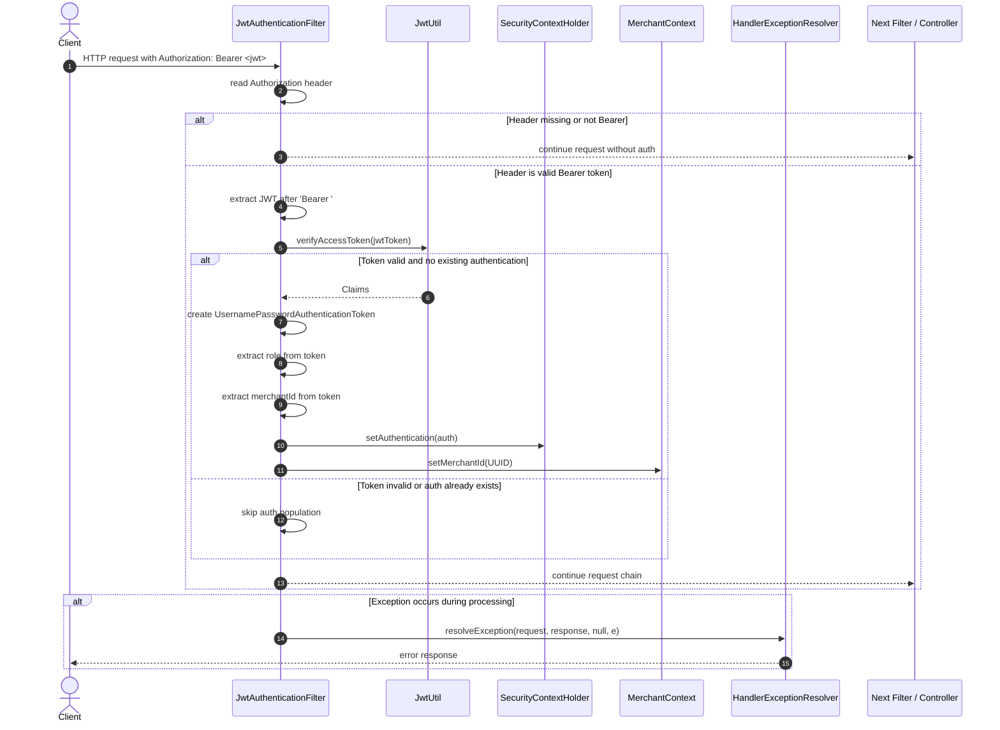

# JwtAuthenticationFilter

## Purpose

`JwtAuthenticationFilter` is a Spring `OncePerRequestFilter` responsible for validating a JWT present in the `Authorization` header for incoming requests. Its job is to authenticate the user, populate Spring Security's `SecurityContext`, and set the current merchant context for downstream business logic.

## Flow

1. The request enters the filter.
2. The filter reads the `Authorization` header.
3. If the header is missing or does not start with `Bearer`, the request is passed through without authentication.
4. If the header is present, the token is extracted and passed to `JwtUtil.verifyAccessToken(...)`.
5. If the token is valid and no authentication already exists in the security context, a `UsernamePasswordAuthenticationToken` is created.
6. The user's role is extracted from the JWT and added as a `ROLE_...` authority.
7. The merchant ID is extracted and stored in `MerchantContext`.
8. The request continues to the next filter or controller.
9. If any exception occurs, it is forwarded to `HandlerExceptionResolver` for centralized error handling.

## Key responsibilities

- Validate bearer JWTs
- Create Spring Security authentication object
- Attach the role from token claims
- Store merchant ID in thread-local / context
- Continue the request chain after successful authentication
- Resolve authentication errors centrally

## Sequence diagram



## Important logic details

### 1. Header validation

The filter checks whether the request contains an `Authorization` header and whether it begins with `Bearer`:

```java
final String authorizationHeader = request.getHeader("Authorization");
if (authorizationHeader == null || !authorizationHeader.startsWith("Bearer")) {
    filterChain.doFilter(request, response);
    return;
}
```

If it is absent or malformed, the request simply continues without authentication.

### 2. JWT verification

The token is verified using `JwtUtil.verifyAccessToken(...)`:

```java
String jwtToken = authorizationHeader.substring("Bearer ".length());
Claims claims = jwtUtil.verifyAccessToken(jwtToken);
```

### 3. SecurityContext population

When the claims are valid and no authentication already exists, the filter creates a Spring Security authentication object:

```java
var auth = new UsernamePasswordAuthenticationToken(
    claims.getSubject(),
    null,
    List.of(new SimpleGrantedAuthority("ROLE_" + jwtUtil.extractRole(claims)))
);

SecurityContextHolder.getContext().setAuthentication(auth);
```

This allows downstream code to call Spring Security APIs and evaluate the current authenticated principal.

### 4. Merchant context population

The filter also stores the merchant ID in a custom `MerchantContext`:

```java
merchantContext.setMerchantId(UUID.fromString(jwtUtil.extractMerchantId(claims)));
```

This is useful when later service logic needs the current merchant without repeatedly reading it from the JWT or request.

### 5. Exception handling

If validation or parsing fails, the exception is handled centrally via `HandlerExceptionResolver`:

```java
} catch (Exception e) {
    handlerExceptionResolver.resolveException(request, response, null, e);
}
```

This keeps authentication failures consistent with the application’s global error-handling strategy.

## Relationship to the rest of the security flow

This filter works alongside other security components such as API-key validation and role-based access checks. It is primarily used for JWT-based merchant authentication, while an API-key filter may validate machine-to-machine access or other specific endpoints.

In practice, this filter ensures that authenticated merchant requests are recognized by Spring Security and that merchant-specific context is available during request processing.
